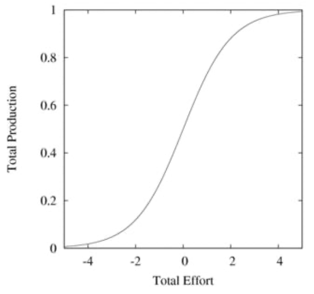
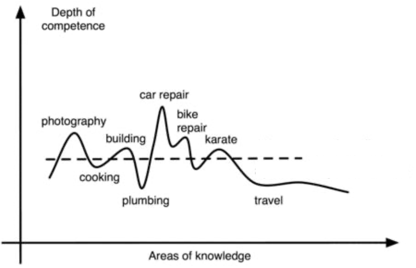

+++
title = 'Bike repair perfectionism'
subtitle = 'What skill level is good enough?'
date = 2024-08-09T12:38:21-04:00
draft = false
+++

On Friday night, I was thinking of getting a new bike because my current one is not in the best condition. Just thinking about it drove me down a rabbit hole of bike repair: I spent all of Saturday and Sunday with my bike and laptop, researching and experimenting with all aspects of repairing broken pedals, rusted shifter cables, and worn-out sprockets and chains. On Sunday night, exhausted and with nothing to show for my efforts, I had to pull myself away from the rabbit hole to spend time on other priorities. I felt like [Monica in *Friends* when she was hammering holes into her wall to find the function of an electric switch](https://www.youtube.com/watch?v=pMuVm1Y669U).

<!-- Woudl be cool to put this into an iframe -->

My girlfriend and close friend asked me why I didn't just buy a new bike, or even a $100 used bike, given that I know enough about bikes to vet their quality. I couldn't explain it for a while. Then the answer dawned on me during a bike ride home: I just hate feeling like a failure at bike repair! And the bike repair rabbit holes were my repeated attempts to prove to myself that I'm good at bike repair.

This wasn't my first bike repair rabbit hole. It's happened a few times over the past few years, and each time, I struggle obsessively for a couple days, learn some new things, and end up making a full fix, hacky fix, or no fix at all. If I can't figure out a fix, inevitably real life interrupts my rabbit hole, I content myself with riding the bike with the slight issue, and I forget about repairing it until several months later. I got so frustrated with this behavior that, two years ago, I created a bimonthly [reminder](https://beeminder.com/) to avoid these rabbit holes.The reminder says, "Don't spend time fixing the bike (except for simple things like pumping tires): my time is too valuable! Better to learn to ride with the issue (e.g. shoddy brakes) or get it serviced."

## Is [bike repair] perfectionism bad?

Most of me thinks that it is. Many bike repairs (like fixing flat tires) are worth doing oneself, and I'm glad that my first rabbit holes taught me those ones.I thought it would be good for my ego to list all the bike-related repairs and maintenance I have been able to do now: 1. Diagnosing the cause of a flat tire and fixing it, by either patching or replacing the tube with a an appropriately sized and valved new tube. 2. Measuring when a chain is worn-out, cutting new chain to the same size, and replacing the old chain with the new one. 3. Replacing a broken bike seat, even one that is stuck to the seatpost. 4. Identifying when rim brake pads are worn out, and replacing them with new ones in the proper position. 5. Replacing a bike tire. 6. Pumping tires to the appropriate pressure [based on calculations](https://www.sheldonbrown.com/tires.html#pressure). 7. Cleaning a bike chain. 8. Knowing the proper height for a bike seat and adjusting the seat heigh accordingly. 9. Knowing what to look for when buying a used bike (very similar to [this](https://forum.earlyretirementextreme.com/viewtopic.php?p=18160&sid=a7d2438236fdd6a6db860a21ca77f030#p18160)). Notably, this list largely overlaps with [these](https://earlyretirementextreme.com/gaining-bike-repair-experience.html) [lists](https://earlyretirementextreme.com/a-few-things-you-can-do-to-optimize-your-bicycle.html) of the highest bang-per-buck repairs. This is probably because I had more success with the easier repairs which were needed more frequently. (One exception I have not yet conquered my fear of: the shifting/cable-related repairs.) But as the repairs get more difficult, I feel these rabbit holes are less worthwhile: they are more frustrating and take more time away from more important (or less frustrating) activities in my life.

If I decide these rabbit holes aren't worth it, what can I do to get out of them sooner? When I can't come up with a fix, the feeling of failure drives my obsession to *try yet again*; if that doesn't pay off, I feel even more like a failure, leading to a failure-retry cycle. One solution would be to change the narrative away from "I'm bad at bike repair." Perhaps I can replace it with this: "Remember, you're already decent at bike repair with all the repairs you *do* know. You gave this new, harder repair a shot and it hasn't worked out yet, which is natural because other amateur bike maintainers don't necessarily know it either! You could probably figure it out with more time, but you don't have to; you could take it into the shop (**and learn from watching the mechanic!** The bike shop mechanic might use tools I can't get at home, in which case the method wouldn't apply. Or they might have an approach I can copy!), buy a new bike or part, or ride it as is."

As a caveat, I'm not saying that perfectionism is bad; clearly some perfectionism drives self-improvement in worthwhile skills. I've always been bad at chess and videogames but never had failure-retry cycles there, perhaps because I don't view those as useful pursuits.I am honestly glad that I'm not good at chess and videogames; if I were good, I might get addicted to them in a cycle of winning. I think I'm happy with perfectionism if the skill feels worthwhile, and if I haven't yet hit low marginal returns to effort in that skill. With bike repair, I feel the skill is *somewhat* worthwhile and that I may be hitting low marginal returns.Evidence for low marginal returns: I've nearly learned all the "useful, easy" repairs in [these](https://earlyretirementextreme.com/gaining-bike-repair-experience.html) [lists](https://earlyretirementextreme.com/a-few-things-you-can-do-to-optimize-your-bicycle.html).

## Maybe I should strive for "medium" competence in many skills

To generalize this beyond bike repair, I'm reminded that Jacob Lund Fisker's *Early Retirement Extreme* describes the path to getting good at any particular skill as a sigmoid curve of reward in terms of effort: increasing marginal rewards at the initial novice stage, and then decreasing marginal rewards in the later "competent" stage:

<!-- Let's turn the above into a margin figure. -->

He then says that each skill in life has a different sigmoid curve, and a person must decide how to allocate their limited effort among the various skills to attain the maximum reward. He concludes that, to live one's best life, the best approach is often to achieve "medium" competence in many skills that matter, rather than trying to maximizing competence in a few skills:This is also reminisicent of Holden Karnofsky's comment on good entrepreneurs: "Entrepreneurship tends to require juggling more duties than one can really learn how to do 'the right way.' It crucially relies on the ability and willingness to handle many things 'just well enough' (usually with very little training or guidance) and focus one's energy on the few things that are worth doing 'reasonably well.'"

<!-- Change Holden quote to blockquotes if time -->

> [P]rofessionals are often encouraged to hyperspecialize, that is to put in maximum effort so that they'll achieve maximum production [right side of sigmoid curve], to win the competition with other professionals and attract the highest salary. If money is the only utility that matters, this is the optimal strategy. If, however, happiness, low stress, leisure time, or other things in the work-life balance also matter, it would result in a different strategy, since the last, say 80% of the effort, to gain the last 20% of the results, would be wasted... you can gain the maximum utility by being relatively competent in large numbers of topics by contributing a nontrivial but fairly small effort.”

For bike repair, there's a good chance that I'm already at the right "medium" competence. Perhaps that's what I need to remind myself to avoid Monica's fate.

Note: A cool future blog post would explicitly argue for the right "medium" competence in multiple skills and try to draw those out with sigmoid curves on one graph.This will be subjective (depending on a person's notion of "reward") and hard to draw out precisely, but perhaps for bike repair, I could list out the repair skills I've enumerated above. Fisker has a graph depicting different skills which could be a start:

<!-- Possible note: check figures resize OK. I'm also curious how to specify smaller sigmoid and whether they're in the figure tags. -->